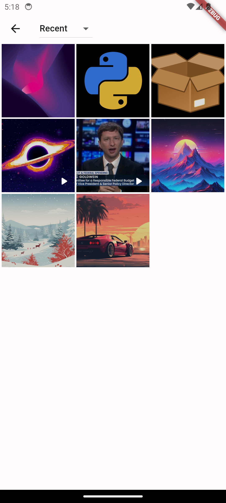
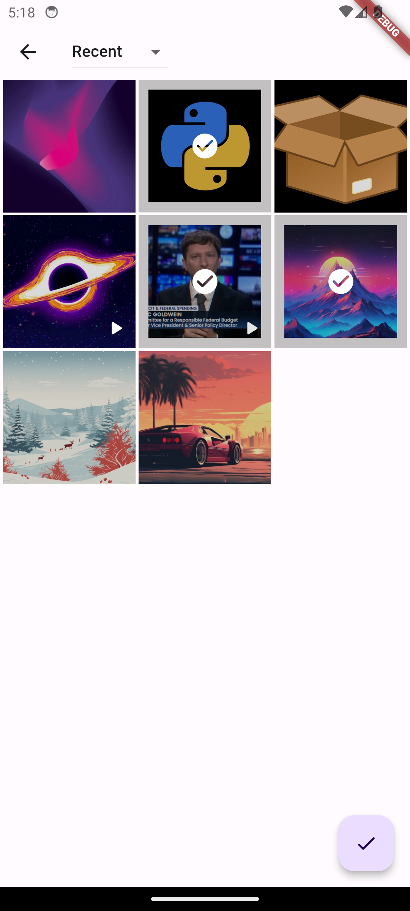
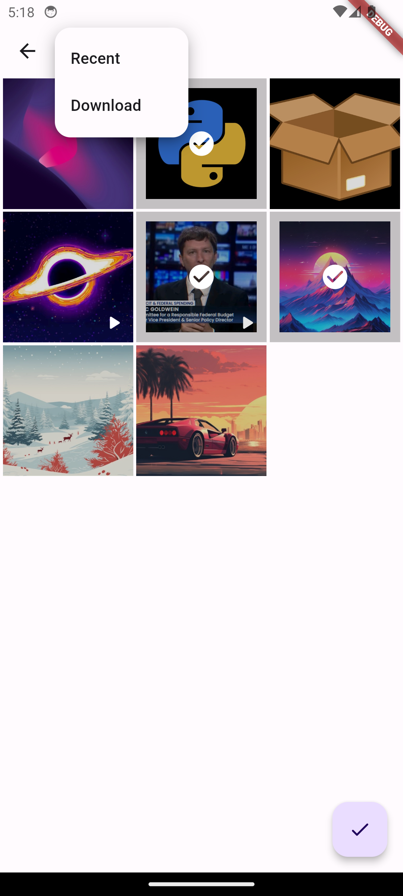
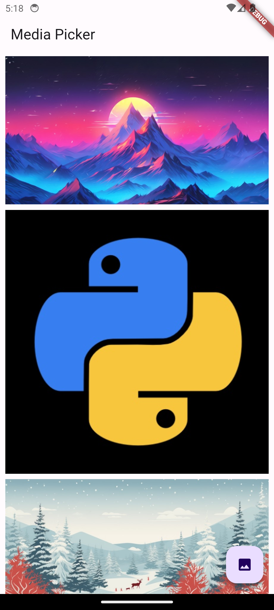

# Custom Media Picker for Flutter

Welcome to the Custom Media Picker repository for Flutter applications! This
repository offers a flexible and customizable media picker solution tailored to
meet the diverse needs of your application.

## Features

- **Flexible Configuration:** Easily configure the media picker to match your
  application's design and requirements.
- **Support for Multiple Media Types:** Choose from a variety of media types
  including images or videos.
- **Customizable UI Elements:** Customize UI components such as buttons, icons,
  and layouts to align with your app's visual identity.
- **Smooth User Experience:** Enjoy a smooth and intuitive user experience with
  optimized performance.
- **Extensive Documentation:** Comprehensive documentation and usage examples
  ensure easy integration and quick implementation.

## Screenshots

  

    
No item selected

    
  

  

    
Items selected

    
  

  

    
Albums open

    
  

  

    
Returned selected items

    
  

## Contributing

We welcome contributions from the Flutter community to further enhance and
improve our custom media picker. Whether it's bug fixes, feature enhancements,
or additional documentation, your contributions are invaluable in making this
project better for everyone.

Happy coding!
